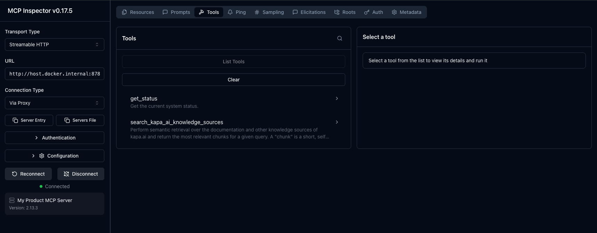

# Kapa MCP Proxy Example

If you already have an MCP server that exposes functionality to your users, and you want to add [Kapa's semantic retrieval](https://docs.kapa.ai/integrations/mcp/overview) for your knowledge bases **without requiring users to install multiple MCP servers**, you can proxy Kapa's MCP server from your existing one.

This example shows how to do this using [FastMCP](https://gofastmcp.com/).

## What is Proxying?

From the [FastMCP docs](https://gofastmcp.com/servers/proxy):

> Proxying means setting up a FastMCP server that doesn't implement its own tools or resources directly. Instead, when it receives a request (like `tools/call` or `resources/read`), it forwards that request to a *backend* MCP server, receives the response, and then relays that response back to the original client.

In this example, we proxy Kapa's retrieval tool so it appears as a native part of your server:

```
┌────────────────────────────────────────┐
│         Your MCP Server                │
│                                        │
│  • get_status (native)                 │
│  • search_*_knowledge_sources ─────────┼──► Kapa MCP Server
│                                        │
└────────────────────────────────────────┘
```

Your users only need to install one MCP server, but get access to both your native tools and Kapa's retrieval.

> **Note:** This example includes a simple native tool called `get_status` to demonstrate how proxied tools appear alongside your own.

## Prerequisites

- Docker
- A Kapa hosted MCP server ([setup guide](https://docs.kapa.ai/integrations/mcp/overview#setup-and-configuration))

## Usage

**1. Configure your Kapa credentials:**

```bash
cp env.example .env
```

Edit `.env` with your credentials from [Kapa Dashboard](https://app.kapa.ai):

| Variable | Description |
|----------|-------------|
| `KAPA_MCP_SERVER_URL` | `https://your-project.mcp.kapa.ai` |
| `KAPA_API_KEY` | Your API key |

**2. Start the containers:**

```bash
docker compose up
```

This starts two containers:
- **MCP Server** (`localhost:8787`) — your server with native + proxied tools
- **MCP Inspector** (`localhost:6274`) — a web UI for browsing and testing MCP tools

**3. Open the MCP Inspector:**

The [MCP Inspector](https://github.com/modelcontextprotocol/inspector) is a developer tool for testing MCP servers. It lets you browse available tools, call them, and see the results.

1. Go to http://localhost:6274
2. The server URL is prefilled — click **Connect**
3. Navigate to the **Tools** tab

You'll see both tools listed:
- `get_status` — your native tool
- `search_<product>_knowledge_sources` — proxied from Kapa



## How It Works

```python
from fastmcp import FastMCP

async def create_server() -> FastMCP:
    mcp = FastMCP(name="My Product MCP Server")

    # Your native tool
    @mcp.tool
    def get_status() -> dict:
        return {"status": "healthy"}

    # Create proxy to Kapa's MCP server
    kapa_proxy = FastMCP.as_proxy({
        "mcpServers": {
            "kapa": {
                "url": os.getenv("KAPA_MCP_SERVER_URL"),
                "transport": "http",
                "headers": {"Authorization": f"Bearer {os.getenv('KAPA_API_KEY')}"}
            }
        }
    })
    
    # Import tools from Kapa
    await mcp.import_server(kapa_proxy)
    
    return mcp
```

## Resources

- [Kapa MCP Docs](https://docs.kapa.ai/integrations/mcp/overview)
- [FastMCP Proxy Servers](https://gofastmcp.com/servers/proxy)
- [FastMCP Server Composition](https://gofastmcp.com/servers/composition)
